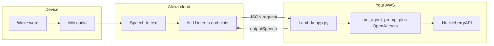

# Alexa voice + Huckleberry agent — architecture and plan

This document captures how the **Alexa custom skill** relates to the **OpenAI (pydantic-ai) agent** and **`HuckleberryAPI`**, what the platform guarantees, and how we can evolve the skill without losing sight of constraints.

## Goal

- **Hands-free** baby logging and short Q&A against Huckleberry data, triggered by the **Alexa wake word**.
- **Same conceptual stack** as a text chat agent: natural language → model + tools → Huckleberry — but delivered over **voice** through Alexa’s pipeline.

## End-to-end flow

1. User speaks after **“Alexa”** (wake word is device-side; we do not implement it).
2. **ASR** turns audio into text (inside Amazon; we do not see every intermediate token).
3. **NLU** matches our **interaction model** (`alexa/interaction_model_en_US.json`) and fills slots (e.g. `AMAZON.SearchQuery` → `query`).
4. **Lambda** (`alexa/app.py`) runs **`run_agent_prompt`** (`src/huckleberry_api/agent_runner.py`): OpenAI + tools → Huckleberry.
5. We return **spoken text**; **TTS** plays it on the device.

## What Alexa supplies vs what we supply

| Piece | Supplied by | Notes |
|--------|----------------|--------|
| Wake word, always listening UX | Echo / Alexa | Not customizable in a custom skill. |
| ASR | Amazon | High quality; not streamed raw to our Lambda by default. |
| **NLU** (which intent, which slots) | **Our interaction model** (+ Amazon models) | **Gate:** if nothing matches, the agent does not see a free-form user string (except paths we design, e.g. `CaptureQueryIntent` slot value, Help, etc.). |
| Session, reprompt, SSML | Amazon + our response | Keeps multi-turn **inside** the skill. |
| Business logic + LLM + Huckleberry | **This repo** (Lambda + `agent_runner`) | Same tools as `examples/huckleberry_agent_cli.py`. |

## Session open ≠ bypassing NLU

After **“open huckle berry”**, you are in a **session** with that skill (context, reprompts, optional session attributes). **Each utterance is still classified** by the **same interaction model** (ASR → NLU → intent/slots → Lambda). Alexa does **not** stream raw transcript to your backend by default, so the model still only sees what NLU puts in slots (or fixed prompts like Help).

## NLU vs LLM (why it is not a chat window)

- **Text chat agent:** each message is roughly **full string → model**.
- **Alexa custom skill (typical):** **audio → ASR → NLU → structured request →** we build a **prompt string** (from slots / fixed help text) **→ model**.

So the **interaction model is not “blocking” OpenAI** — it **selects which strings** (or fixed prompts) reach the agent. Expanding carriers and intents **widens** what becomes a prompt; it does not remove the NLU step.

## Current implementation (repo)

| Artifact | Role |
|----------|------|
| `alexa/interaction_model_en_US.json` | Invocation **`huckle berry`**, **`CaptureQueryIntent`** (`query` = `AMAZON.SearchQuery` with carrier phrases), extended **`AMAZON.HelpIntent`** samples (meta questions → same agent with help prompt), **`AMAZON.FallbackIntent`**. |
| `alexa/app.py` | ASK SDK: `LaunchRequest`, `CaptureQueryIntent` → `run_agent_prompt(slot text)`, `HelpIntent` → agent with capabilities prompt, `FallbackIntent` → friendly reprompt (no raw transcript). |
| `src/huckleberry_api/agent_runner.py` | Shared agent + tools; used by CLI and Lambda. |
| `template.yaml` + `alexa/Dockerfile` | SAM container Lambda deploy. |
| `alexa/README.md` | Deploy, env vars, phrasing (**ask huckle berry to …**). |

## Plan forward (prioritized)

### Near term (low cost, high value)

1. **Operational:** Keep **interaction model** and **Lambda** in sync after edits (`sam build && sam deploy`; rebuild model in the developer console).
2. **NLU coverage:** When a real utterance fails or hits **Fallback**, add a **new carrier** or **Help** sample that matches how your household talks; rebuild model.
3. **Household script:** One-shot **“Alexa, ask huckle berry to …”** plus in-session **“log …”** / **“tell me …”** without repeating the invocation name (documented in `alexa/README.md`).
4. **Observability:** Use **CloudWatch** logs on the Lambda to see timeouts, tool errors, and missing env vars.

### Medium term (if you want “smarter” without changing platform)

5. **Prompt tuning:** Adjust `_AGENT_INSTRUCTIONS` / tool descriptions in `agent_runner.py` for **voice** (shorter answers, fewer numbers in one breath, confirm destructive writes if you add them later).
6. **Optional intents:** Add small custom intents for **very common** actions (e.g. “quick bottle four ounces”) if NLU consistently misparses them — still can delegate body text to the agent or call APIs directly.
7. **Secrets:** Move long-lived secrets from plain Lambda env vars to **Secrets Manager** / SSM if the skill becomes long-lived.

### Longer term (bigger platform bets)

8. **Alexa Conversations** (or similar Amazon dialog products): useful if you want **designed multi-turn flows** with less hand-maintained utterance lists; still usually calls **your** Lambda for writes. Evaluate only if custom intents + SearchQuery stop scaling for your UX.
9. **Certification / public listing:** Invocation naming, trademark, and privacy policy requirements become stricter; may need a less brand-adjacent invocation than **`huckle berry`** for store submission.

## Passing questions through to the agent

Two paths:

1. **`CaptureQueryIntent` + `query` slot (`AMAZON.SearchQuery`)**  
   Whatever NLU puts in **`query`** is passed **verbatim** to **`run_agent_prompt(text, ...)`**.  
   Examples: *“tell me what all you can do”* → carrier **tell me** + `query` ≈ *“what all you can do”*; *“hey list your tools”* → **hey** + `query` ≈ *“list your tools”*.  
   So **yes** — arbitrary natural questions work **once** they match a sample pattern with a required carrier phrase.

2. **`AMAZON.HelpIntent` + extra samples**  
   Phrases like *“what can you do?”* or *“list available tools”* (see `interaction_model_en_US.json`) route to **Help**. The Lambda handler sends a **fixed help prompt** (not the exact ASR string — Alexa does not expose it the same way on built-in Help). The prompt instructs the **same** OpenAI agent to answer meta questions and “list tools” in parent-friendly language.  
   To support new meta phrases, **add utterances to Help** (or use path 1) and rebuild the model.

## Hard limits (expectations)

- **`AMAZON.FallbackIntent`:** we do **not** receive the full raw user sentence in the usual payload — we cannot send “whatever they said” to OpenAI on fallback without a different design (and often not supported the same way as web chat).
- **True open-domain voice chat** on Alexa is **not** the default custom-skill shape; our approach (**wide SearchQuery + Help → agent**) is the pragmatic fit for **Huckleberry + hands-free**.

## Related links

- Deploy and test: `alexa/README.md`
- **Tool list + NLU vs tools:** [`agent-tools-and-alexa-nlu.md`](agent-tools-and-alexa-nlu.md)
- Repo agent rules: `AGENTS.md`
- Reverse-engineering / schema rules: `firebase_types.py`, `api.py` (see `AGENTS.md`)

When this plan changes (e.g. new intent strategy), update this file and the **Current implementation** table in the same commit.
